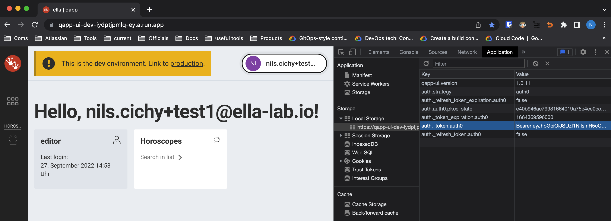

# Authentication with Auth0

## General Idea

For authentication, we are using [auth0](https://auth0.com/) as external service. Auth0
follows [the oauth2 protocol](https://oauth.net/2/). In practice, this means our backends never see credentials
(username/passwords), but only signed tokens ([JWT](https://jwt.io/)) that contain information about the user (
permissions, roles, etc.). The user received the token by logging in in auth0's page, and he only "transfers" it to the
backend as a header to each one of his request. The backend can then verify the authenticity of the token (because it is
signed) by using the public key the auth0 provides. (see asymmetric encryption)

In [Auth0's documentation](https://auth0.com/docs/get-started/authentication-and-authorization-flow/authorization-code-flow)
you can find a great sequence diagram explaining the different steps.

From the perspective of the backend, the only interaction we have with auth0 is retrieving the public key(s) (from
a [JWKS](https://auth0.com/docs/secure/tokens/json-web-tokens/json-web-key-sets#:~:text=The%20JSON%20Web%20Key%20Set,signing%20JWTs%3A%20RS256%20and%20HS256.))
in order to verify the signature of the jwt given in the header of every request.

## JWT structure

A JWT is the addition of 3 components: the header, the payload and the signature. Once encoded, these represent three
strings separated by points. (You can see a generic JWT on the landing page of [jwt.io](https://jwt.io),
and [here](https://jwt.io/introduction) there is better and longer explanation of *what* is a jwt).

The information in a JWT is decodable without the public key, but it is then still unverified (you can enter your jwt
in [jwt.io](https://jwt.io) and be able to see all its content. In order to verify its authenticity, the backend has to
verify the signature with the right algorithm and key (we use the util `jwt.decode()` from python-jose that handles that
for us)

## Header

```json
{
  "alg": "RS256",
  "typ": "JWT",
  "kid": "iujhlijuniunilon"
}
```

- we use currently RS256 as encrypting algorithm
- in the header must be the key_id (in order to know which one to use from the JWKS to verify the signing)

### Payload

Most of the fields in the jwt's payload are specified either by the jwt convention or by auth0. Some fields are
additional, added
by us, and the keys of these fields look like urls (currently: `"https://qapp.api.module/roles"`
and `"https://qapp.api.module/app_metadata"`).

```json
{
  "https://qapp.api.module/roles": [
    "role1"
  ],
  "https://qapp.api.module/app_metadata": {},
  "iss": "https://my_auth_domain.eu.auth0.com/",
  "sub": "auth0|anUniqueIDHash",
  "aud": [
    "https://my_auth_domain.api.module"
  ],
  "iat": 1664195833,
  "exp": 1664282233,
  "azp": "AB9e5WvuL7W43CoBFgEMifv8Esq3yGhh",
  "scope": "openid profile email",
  "permissions": "read:my_resource edit:my_resource"
}
```

relevant parts:

- `sub`: Here is a unique identifier for this user, containing the authentication method first (e.g `auth0`
  or `googleauth`, then a pipe `|` than the actual auth0 uid of the user.
- `permissions`: here are all the permissions the user has. Each api endpoint will compare its required permissions to
  the permissions of the user, accepting or denying (with HTTP status code 401) depeneding on it.
- `https://qapp.api.module/roles`: That is the names of all roles this user is registered as in the auth0 instance.
- `exp`: the timestamp where this jwt expires.
- `iss` (issuer), `aud` (audience) are as well relevant, but I didn't understand 100% yet. Right now what is
  important here is that they are used (as parameters) for decoding the jwt, and the parameters and the actual values in
  the jwt must match in order to accept the connection. Those values are in environment variables in the backend.

The backend might save some data about the users, in its database. In this case, the entries (or documents if it's a
noSQL DB) are indexed (and therefore accessible) by the user's uid (2nd part of `sub`).

### Signature

This is simply the combination of the header and the payload, encrypted by the private key. As only the auth0 instance
knows the private key, if we can decode the signature with the public key auth0 gives us, we can be sure it created the
jwt and not an impostor.

## How to get your header

If you want to manually set up the headers with a "real" jwt connected to the auth0 API, the easiest way is to
go to the product page and login with your credentials, then opening the navigator console (Mac: Cmd + opt + I, Windows:
F12), look into local storage, there should be something like `auth._token.auth0` with value `"Bearer "` followed by the
signed jwt.

Example of how it looks like on Mac + Chrome:


## Auth in tests (keep tests local)

In order to be able to automatically test the backend's authentication process (for instance as part of the CI-CD
pipeline), we mock the auth0 jwks api by having a local key pair in the file `src.tests.auth0_keys.py`, in order to be
able to generate and sign (with the private key) a jwt ourselves, then telling the backend to use a mocked JWKS (
containing the public key) with [a dependency injection](https://fastapi.tiangolo.com/tutorial/dependencies/) (
in `src.tests.conftest` in the client fixture).

## Specify required permissions

Permissions can be defined at the level of any function that will be dependency injected in a route, by giving a
parameter to this function with default value `Security(my_callable, scopes="read:resource edit:resource")`.
`scopes=` contains then the permissions the user must have in order for this method to be executed. `my_callable` could
include as well a parameter `Security` with other permissions again. FastAPI aggregates over all the levels in order to
have a complete list at the
end. [FastAPI documentation about Security and Scopes](https://fastapi.tiangolo.com/advanced/security/oauth2-scopes/)

Examples in `src.routes.user_management_routes.py`
